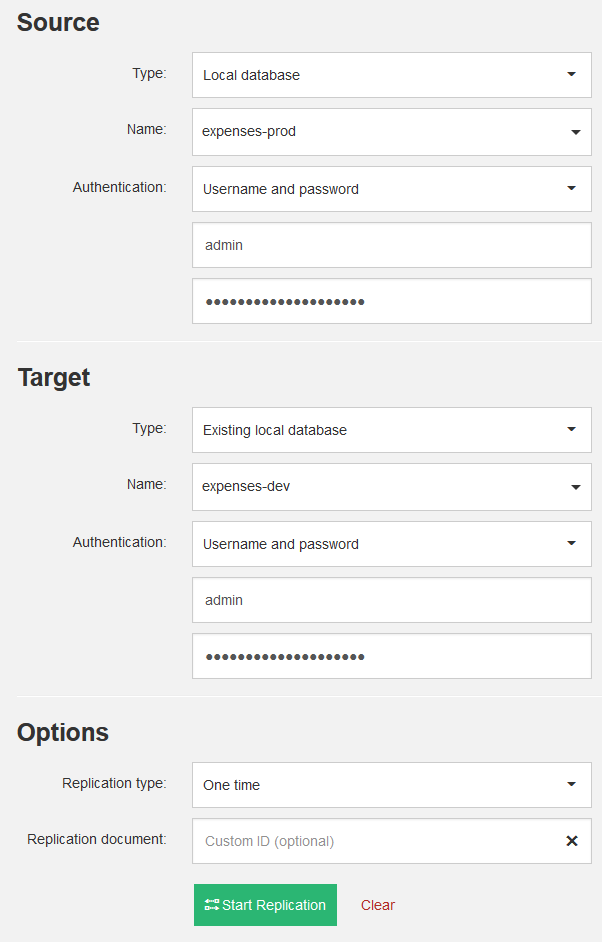

# Einrichtung
## Entwicklungsumgebung
- node.js
- VS Code
- VS Code Extensions
  - SCSS formatter
  - sort-imports
- CouchDB
- CouchDB einrichten
  - `http://localhost:5984/_utils` (Fauxton) &rarr; *Config*
    - neue Datenbank: expenses-dev
      - Permissions
        - Members &rarr; Roles: *_admin* entfernen
    - Config &rarr; CORS &rarr; Restrict to specific domains `http://localhost:3000`, `https://localhost:3000`, `https://localhost:9767`, …
- Starten mit `npm start`
- Aktuell ist Testing nur mit einer HTTPS-CouchDB möglich. Als Workaround `db.js` `databaseConnectionString` anpassen:
  - `https` &rarr; `http`
  - `6984` &rarr; `5984`
- Falls Testing mit Service Worker benötigt wird, HTTPS einrichten (s.u.) und `npm run int` starten. Int verwendet dieselbe Datenbank wie dev und ist unter `http`**s**`://localhost:3000` erreichbar. Private Fenster zum Testen empfohlen

### Optional
- GitExtensions & KDiff3 für einfache 3-way merges und Cherry-Picks
- Chocolatey
- Chocolatey upgrade all task
- VS Code Extensions
  - Todo Tree
  - Markdown All in One

## HTTPS
Wird benötigt für Produktivumgebung und Testing mit Service Worker
- Self-signed Zertifikat erstellen
  - mkcert installieren
  - `mkcert -install`
  - `mkcert -key-file key.pem -cert-file cert.pem laptop-crispin 192.168.178.49 localhost 127.0.0.1 ::1`
      `laptop-crispin` durch lokalen DNS-Namen oder static (lease) IP ersetzen
  - `mkcert -CAROOT` Aus diesem Ordner das File `rootCA.pem` auf Telefon und nach `C:\Program Files\Apache CouchDB\etc\certs` kopieren
- Self-signed Zertifikat auf Telefon vertrauen
  - Auf Telefon (Beispiel Android)
    - *Einstellungen* &rarr; *Sicherheit & Standort* &rarr; *Verschlüsselung & Anmeldedaten* &rarr; *Von SD-Karte installieren*
    - Unter *Vertrauenswürdige Anmeldedaten* &rarr; *Nutzer* prüfen ob die neue mkcert CA aufgelistet ist
- CouchDB
  - `key.pem`, `cert.pem` nach `C:\Program Files\Apache CouchDB\etc\certs` kopieren
  - Fauxton &rarr;  *Config* &rarr; *Main config*
    - 4x *Add Option*. *Section*: `ssl`
      1. *Name*: `enable`, *Value*: `true`
      2. *Name*: `cacert_file`, *Value*: `./etc/certs/rootCA.pem`
      3. *Name*: `cert_file`, *Value*: `./etc/certs/cert.pem`
      4. *Name*: `key_file`, *Value*: `./etc/certs/key.pem`

## Produktivumgebung
- neue CouchDB erstellen: `expenses-prod`
  - Members &rarr; Roles: _admin entfernen
- HTTPS einrichten (siehe Abschnitt HTTPS)
- `npm run deploy`
- Firewall konfigurieren
  - Start &rarr; Windows Defender Firewall &rarr; Erweiterte Einstellungen &rarr; *Eingehende Regeln* &rarr; *Neue Regel...*
  - Programm: `%ProgramFiles%\Apache CouchDB\erts-9.3.3.14\bin\erl.exe`
  - Profile: *Privat*
  - Protokolltyp: *TCP*
  - Lokaler Port: *6984*
- Autostart einrichten für `%LocalAppData%\Expenses\expenses.vbs` (Verknüpfung in `C:\Users\%USER%\AppData\Roaming\Microsoft\Windows\Start Menu\Programs\Startup` anlegen)

# Entwicklung
## Klon von PROD nach DEV machen
In Fauxton auf *Replication* klicken. Dort diese Einstellungen eingeben:

Das ist kein richtiger Dump. Testdaten die nicht auf PROD existieren werden nicht von DEV gelöscht.

# Checkliste Regressionstest
1. Overview aufklappen/zuklappen
2. Monat wechseln
3. Einnahme CHF wiederkehrend bearbeiten
4. Ausgabe CHF wiederkehrend bearbeiten
5. Neue Ausgabe einmalig
6. Neue Ausgabe wiederkehrend
7. Neue Ausgabe einmalig Fremdwährung
8. neue Einnahme
9. Kalender aufmachen
10. Einnahme CHF einmalig bearbeiten
11. Einnahme € wiederkehrend bearbeiten
12. Tag wechseln
13. Ausgabe einmalig CHF bearbeiten
14. Ausgabe einmalig € bearbeiten
15. Diagramm aufmachen
16. Hover testen
17. Tooltips testen
18. Label zu Dimension "Standard" hinzufügen, Farbe wechseln
19. Heute-Knopf klicken
